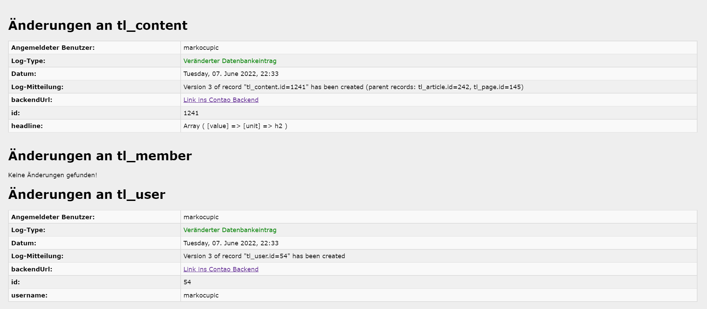
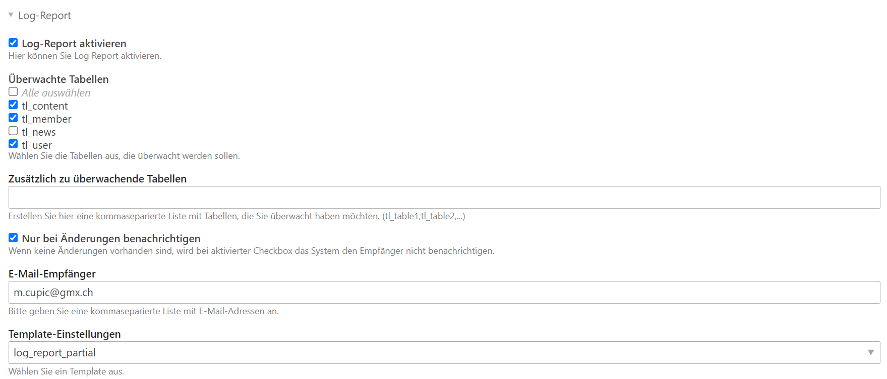

# Log Report Bundle

Diese Erweiterung für [Contao CMS](https://contao.org) prüft jeden Tag das Contao Log und durchsucht dieses nach Einträgen zu neuen oder geänderten Datensätzen. 
  Die Tabellen, nach denen gescannt werden soll, sind konfigurierbar. Wird ein neuer Eintrag im Log gefunden, 
  kann eine Nachricht an beliebige E-Mail-Empfänger versandt werden. 
  Die Nachricht enthält den direkten Link zum jeweiligen Datensatz im Contao Backend.

Beispielsweise kann auf diese Weise ein Admin informiert werden, dass ein neuer News-Beitrag erstellt worden ist, der geprüft werden muss.

Benachrichtigung bei Änderung über E-Mail

Contao Backend Einstellungen

Viel Spass mit "Log Report Bundle"
